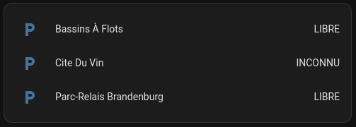
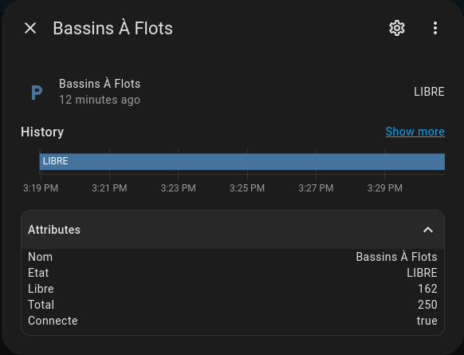

#Home Assistant Integration - Bordeaux Métropole - Parking hors voirie

Une clef est nécessaire pour interroger le webservice

[Formulaire de demande de clé](https://data.bordeaux-metropole.fr/opendata/key)





```yaml
sensor:
  - platform: bdx_parkings
    bdx_data_key: !secret bdx_data_key
    parking_ids: 'CUBPK100'
    scan_interval: 3600
  - platform: bdx_parkings
    bdx_data_key: !secret bdx_data_key
    parking_ids: 'CUBPK80'
    scan_interval: 3600
  - platform: bdx_parkings
    bdx_data_key: !secret bdx_data_key
    parking_ids: 'CUBPK44'
    scan_interval: 3600
```


[Exemple dataset](https://opendata.bordeaux-metropole.fr/explore/dataset/st_park_p/table/) pour trouves les ids des parkings