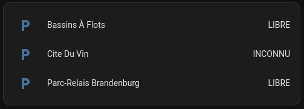
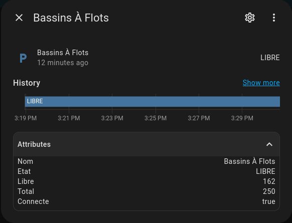

# Home Assistant Integration - Bordeaux Métropole - Parking hors voirie

Intégration interrogeant l'API [opendata Bordeaux Métropole](https://opendata.bordeaux-metropole.fr/explore/dataset/st_park_p/table/) pour exposer dans Home Assistant l'état d'occupation d'un parking hors voirie (places libres, total, état d'ouverture).

## Installation

Une clé API est nécessaire pour interroger le webservice.

[Formulaire de demande de clé](https://data.bordeaux-metropole.fr/opendata/key)

Ajoutez l'intégration depuis **Paramètres > Appareils et services > Ajouter une intégration > Bordeaux Parkings**, en renseignant la clé et l'identifiant du parking (ex. `CUBPK80`). Pour suivre plusieurs parkings, ajoutez l'intégration plusieurs fois, une fois par identifiant. [Exemple de dataset](https://opendata.bordeaux-metropole.fr/explore/dataset/st_park_p/table/) pour trouver les ids des parkings.




## Entités exposées

Une entité par parking configuré, nommée d'après le nom du parking renvoyé par l'API.

| Entité | Valeur | Attributs |
|---|---|---|
| `sensor.<nom_du_parking>` | État du parking (`ouvert`, `fermé`, `complet`...) | `nom`, `etat`, `libre`, `total`, `connecte` |

## Exemples

### Carte Lovelace

```yaml
type: entities
title: Parkings
entities:
  - entity: sensor.parc_relais_brandenburg
    name: Parc-Relais Brandenburg
  - entity: sensor.bassins_a_flots
    name: Bassins à Flots
```

### Automatisation : alerte parking complet

```yaml
automation:
  - alias: "Parking - Alerte complet"
    trigger:
      - platform: state
        entity_id: sensor.parc_relais_brandenburg
        attribute: libre
        to: "0"
    action:
      - service: notify.mobile_app
        data:
          title: "Parking complet"
          message: >
            {{ state_attr('sensor.parc_relais_brandenburg', 'nom') }} est complet
            ({{ state_attr('sensor.parc_relais_brandenburg', 'total') }} places).
```
